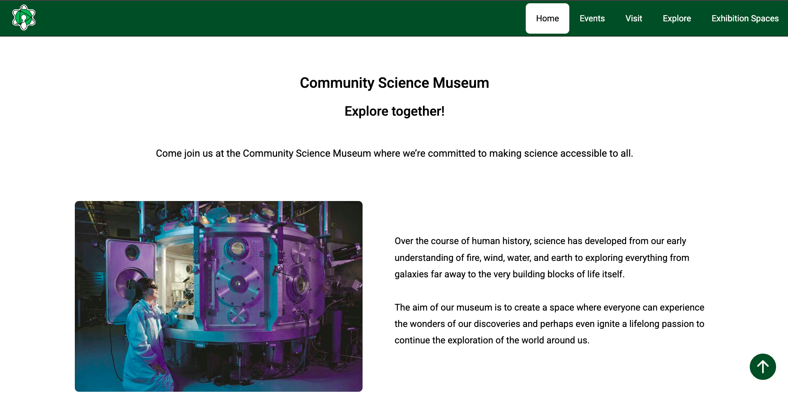

# Community Science Museum

Hello there! 👋🏼

This is my Semester Project for November to Desember 2024.

## 🌐 Live website

You can view the live project here: [martir2109.github.io/Community-Sciecne-Museum](https://martir2109.github.io/Community-Science-Museum/)

## 📸 Website Preview

Here is a screenshot of the live website:

# The Brief

An interactive science museum called the Community Science Museum is opening in your town/city. Its core target audience is primary and middle school children (ages 7-15) and families with young children.

The website should be informative and engaging, encouraging viewers to visit the museum. It should also be responsive and easy to use on various devices. Peer/Teacher review is recommended.

You have been provided with media assets such as text and images (see link under Resources). You must decide how these will be used in terms of presentation, hierarchy, and design. If any assets are too large, remember to optimize file sizes to ensure smooth loading and a polished user experience.

You have the choice to work on this individually or as part of a team of two.

# Requirements

- Plan the project using a project planning board
- The site must have a design that appeals to the target audience.
- The site must have at least 4-6 pages.
- Compositional principles, typography, and colour schemes must be considered.
- HTML should be semantic and neatly indented.
- External CSS stylesheets should follow the DRY principle.
- The site should load quickly, with image sizes capped at 200kb.
- WCAG principles must be applied to hierarchy, navigation, and colour usage.
- The site must be responsive, attractive, and user-friendly across devices.
- SEO practices such as meta tags and alt text must be implemented.
- Using the template provide, write a report discussing what went well, what did not go well in the development process

# User Stories

- As a developer, I want to plane the project using a project planning tool and keep it updated throughout the development process
- As a visitor, I want the website to appeal to children so they feel encouraged to visit the museum with their families.
- As a user, I want to browse through the deployed site without any issues.
- As a visitor, I want the website to adapt seamlessly to any device, so it is easy to interact with on mobile, tablet, or desktop.
- As a visitor, I want at least 4-6 pages with clear navigation.
- As a visitor, I want the site to load quickly, even on slow connections, so I can easily access it.
- As a user with disabilities, I want the website to follow accessibility guidelines so I can navigate independently.
- As the site owner, I want good SEO to rank higher in search engines and attract more visitors.
- As a developer, I want the GitHub repository public to allow for collaboration and code review.

# Submission Guidelines

The following must be added in your PDF report (use the template provided) and submit on moodle

- A live version link of the site
- A link to the site’s prototype
- A link to the project planning board and GitHub repository.
  Note: Resources and templates are provided under the project resources folder.

# Assignment Grading Tool - criteria

- High-definition prototype for mobile and desktop (2 points)
- UX/UI: Responsiveness and accessibility (2 point)
- HTML is bug-free and semantic (2 points)
- CSS follows DRY principles (2 points)
- Website is responsive (4 points)
- Each page has unique titles and descriptions (1 point)
- Each page has a unique H1 (1 point)
- Images are below 200kb (1 point)
- Colors are WCAG compliant (1 point)
- Images have alt text (1 point)
- Project is well-organized and files are formatted (1 point)
- Report includes lessons learned and challenges (1 point)
- Project successfully planned and completed (1 point)

## 🗂️ Project structure

📁 css/

    └── 📁 projects/

          ├── 📄 about.css

          ├── 📄 contact-us.css

          ├── 📄 events.css

          ├── 📄 exhibition-spaces.css

          ├── 📄 explore.css

          ├── 📄 get-involved.css

          └── 📄 visit.css

    ├── 📄 footer.css

    ├── 📄 index-body.css

    ├── 📄 navbar.css

    └── 📄 stylesheet.css

📁 html-pages/

    ├── 📄 about.html

    ├── 📄 contact-us.html

    ├── 📄 events.html

    ├── 📄 exhibition-spaces.html

    ├── 📄 explore.html

    ├── 📄 get-involved.html

    └── 📄 visit.html

📁 images/

    └── 📁 Logos/

            ├── 📄 logo-sience-no-background.png

            ├── 📄 logo-with-some-white-background.png

            └── 📄 open-science-735787.jpg

    └── 📁 screenshot/

            └── 📄 CommunityScienceMuseum.png

    ├── 📄 andrew-ruiz-348421.jpg

    ├── 📄 ball-1010907_1920.jpg

    ├── 📄 billetto-editorial-334686.jpg

    ├── 📄 celso-405219.jpg

    ├── 📄 exhibition-1863344_1920.jpg

    ├── 📄 genoa-956405_1920.jpg

    ├── 📄 heart-2607178_1920.jpg

    ├── 📄 jesse-orrico-60373.jpg

    ├── 📄 lab-512503_1920.jpg

    ├── 📄 learn-2405206_1920.jpg

    ├── 📄 library-1132573_1920.jpg

    ├── 📄 luke-ellis-craven-400722.jpg

    ├── 📄 learn-2405206_1920.jpg

    ├── 📄 mammoth-1257288_1920.jpg

    ├── 📄 markus-spiske-197281.jpg

    ├── 📄 mavis-cw-164128.jpg

    ├── 📄 people-219985_1280.jpg

    ├── 📄 pexels-igor-starkov-233202-1307698.jpg

    ├── 📄 roberto-nickson-396152.jpg

    ├── 📄 samuel-zeller-113381.jpg

    ├── 📄 science-2799817.jpg

    ├── 📄 scientific-2040795_1280.jpg

    ├── 📄 scott-webb-102825.jpg

    ├── 📄 skeleton-414543_1920.jpg

    ├── 📄 teacher-2816112.jpg

    ├── 📄 toa-heftiba-412579.jpg

    └── 📄 william-bout-264826.jpg

📁 js/

    └── 📄 navbar.js

📄 index.html

📄 readme.md
